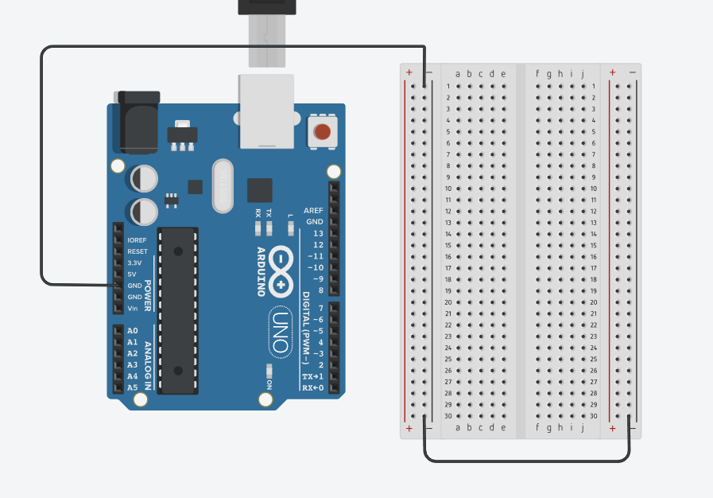
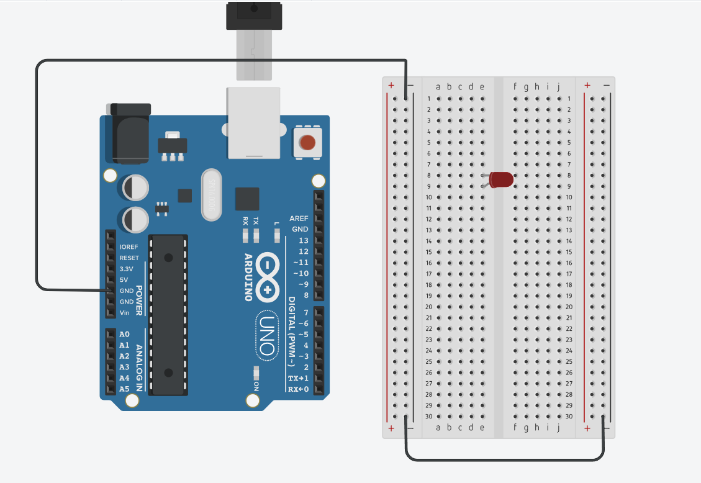
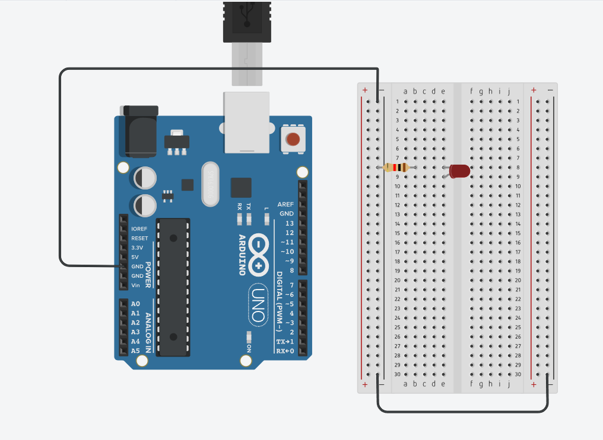
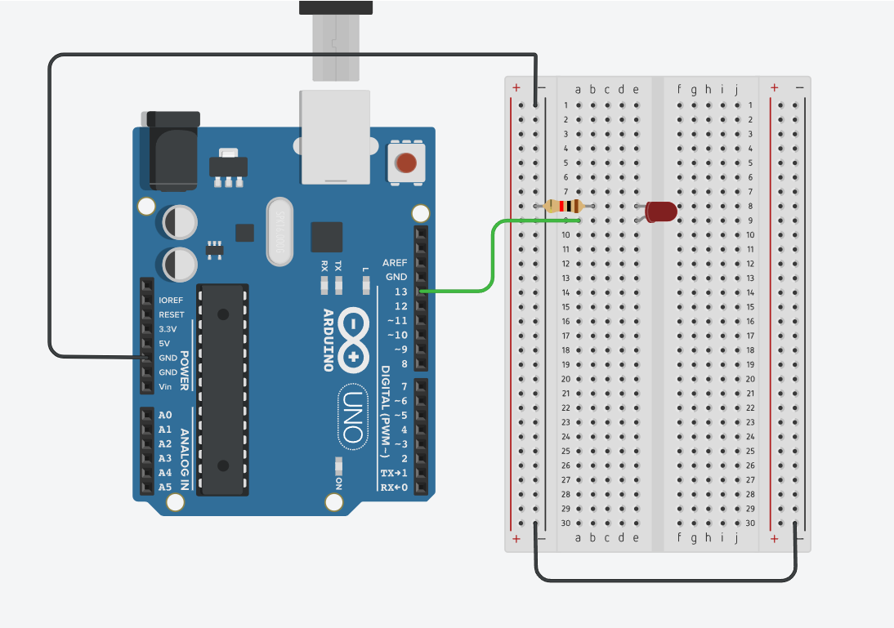
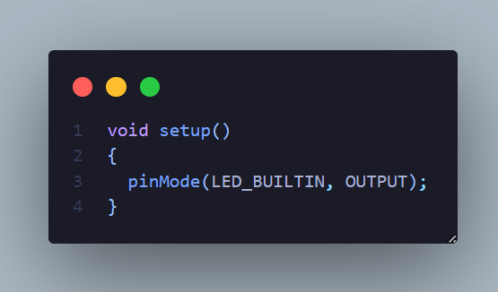
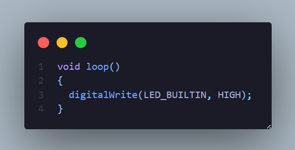
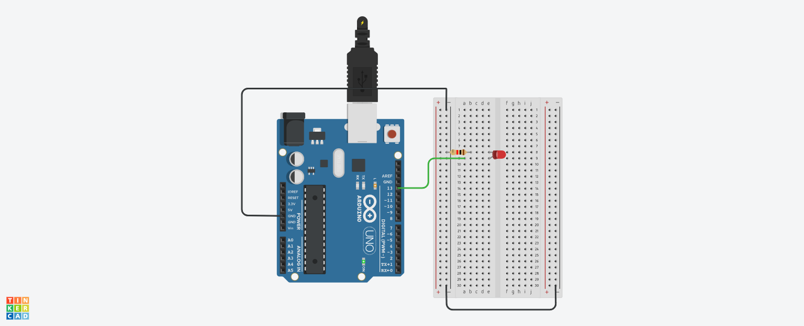
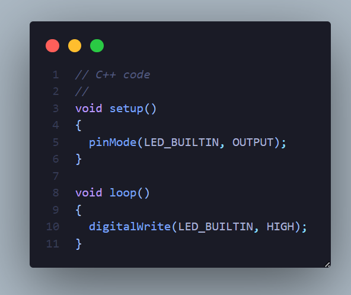

# How to Turn on LEDs 

This file explains how to setting up the breadboard and the code so that is possible to turn a LED (or multiples) on.

## 1. Setting up the circuit

### 1.1 Ground Conection

First of all, is needed to establish an conection between the GND (ground) to the negative bus of the Arduino.



This step makes with that every connected components has the same gorund reference.

### 1.2 Put the LED 

After make the ground connection, put the LED into the breadbord in the way that the cathode and anode "legs" stay in diferents rows, like this:



### 1.3 Put the resistor

Then, add a resistor between the cathode row and ground bus. The resistor is connected with the cathode leg of the LED because it must be connected to the GND (ground) so the 
current can flow correctly through the LED.



### 1.4. Conect the LED with the Digital Output

After that, is possible to connect the anode leg of the LED row to the digital output pin of the Arduino. For this example, the port connect is the 13. This port is especial because it is the same as the Built in Led of most of Arduinos. 



## 2. Code to make it happen!

The code to make it work is avalieble on this folder, but, in this section there will be an explanation to it.

### 2.1 Setup function

In this function, we configure the pinMode for our LED Pin using the ```pinMode() ```function. This function has as syntax:

```
pinMode(pin, mode)
```

Where:

- ```pin```: the Arduino pin number to set the mode of.
- ```mode```: ```INPUT, OUTPUT, or INPUT_PULLUP```. 

On our code, the setup code has only one line corresponding to the pinMode config. 



In that way, is possible to notice that we're setting up our pin 13 to be an Output.

### 2.2 Loop function

This function will be executed in a loop (as the name tells). On our code, is necessary only one line to make with the LED turn on. It was used an function called ```digitalWrite``` that write a ```HIGH``` or a ```LOW``` value to a digital pin.

It syntax is:

```digitalWrite(pin, value)```

Where:

- ```pin```: the Arduino pin number.
- ```value```: HIGH or LOW.

As our pin has been configured as an ```OUTPUT``` in the ```pinMode()```, its voltage will be set to the corresponding value:

- 5V for ```HIGH``` making with our LED turn on;
- 0V for ```LOW``` making with our LED turn off;



## 3. Results

### 3.1 Circuit final result



### 3.2 Code overview

